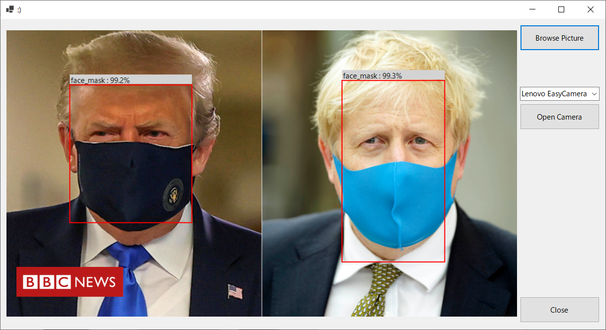
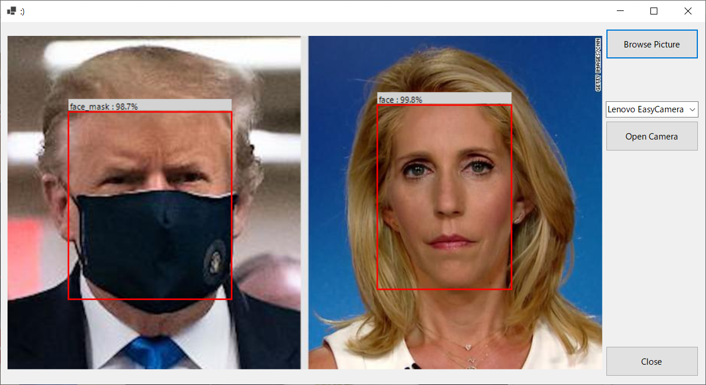
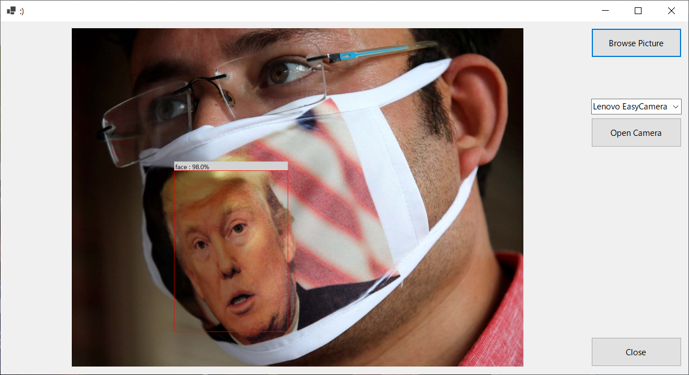

# face_detect

This is an AI model detecting face and face-with-mask from a picture or camera captures.

With the great Yolov4, I trained a model to detect face and face-with-mask. It can detct face(s) in a picture in (arount) 200ms, cpu only (not measured it in GPU environment).

The Yolo config and weights file can be found in data folder. 
(NOTE: the facex.weights file should not be used for commercial purpose as stated in the license file.)

There have some detecting result samples:

You may use this model with darknet app itself, or with the library "DarkPredictor" I made, at https://github.com/tyouhyou/DarkPredictor . It provides a set of simple I/F for c++ or c.

And a sample to use the libray is in the cs_win_app folder of this repository.

cs_win_app is a c# project using pinvoke to work with DarkPredictor.dll. And the above detection sample pictures are screen-shots of this app.

The depencent libraries of cs_win_app are as follows. And they are not included in the c# project. You may build or download them by youself.

- DarkPredictor.dll (or .so)
- darknet.dll (or .so)
- pthreadVC2.dll (if you use darknet.dll)
- pthreadGC2.dll (if you use darknet.dll)

Have fun!
